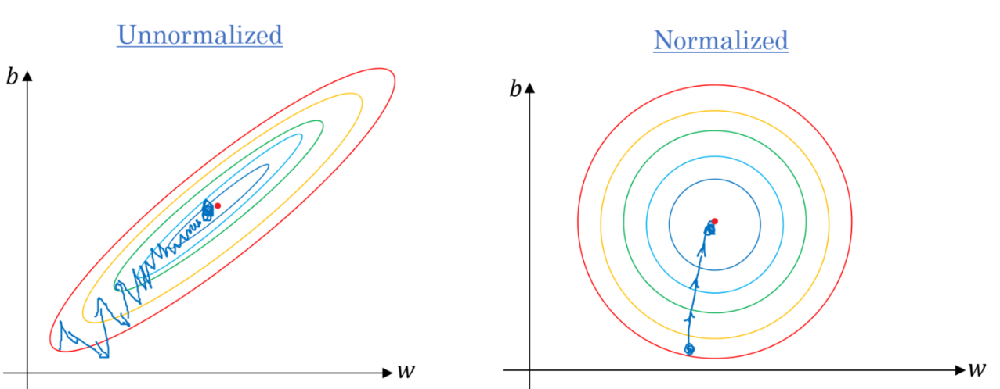
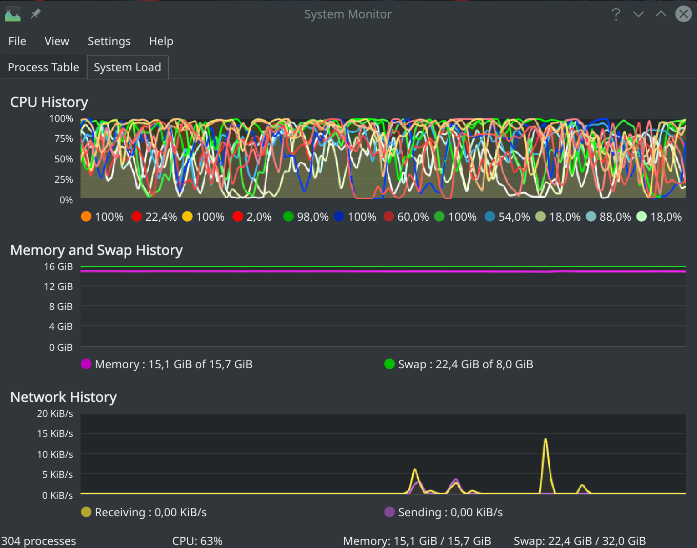
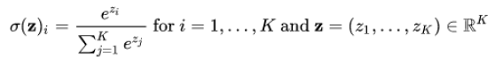
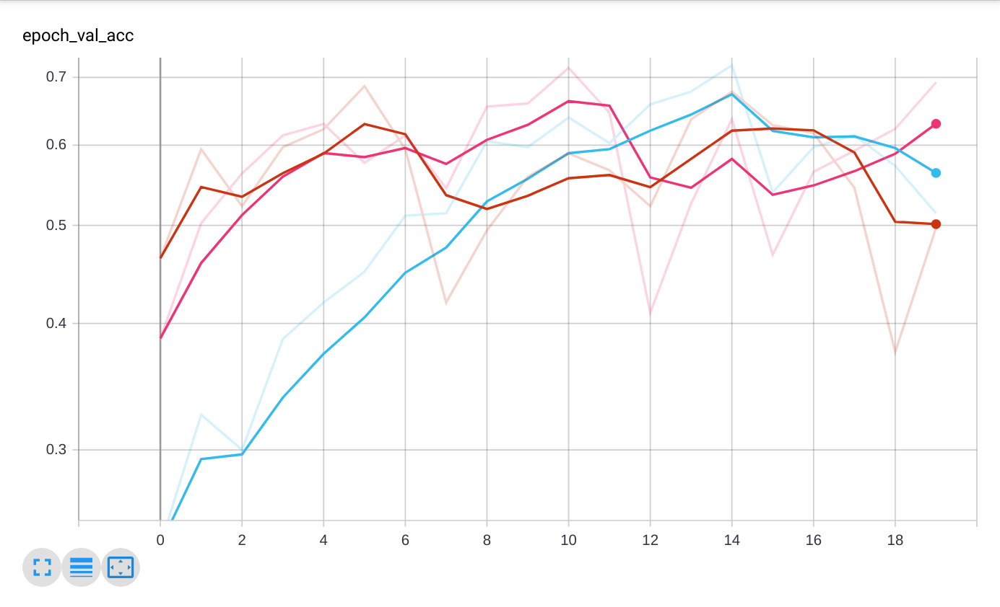
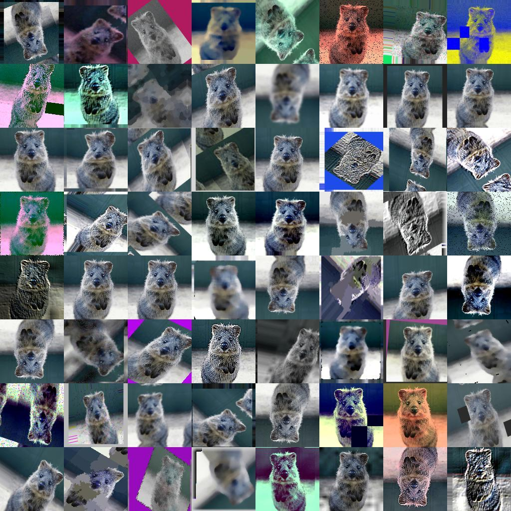
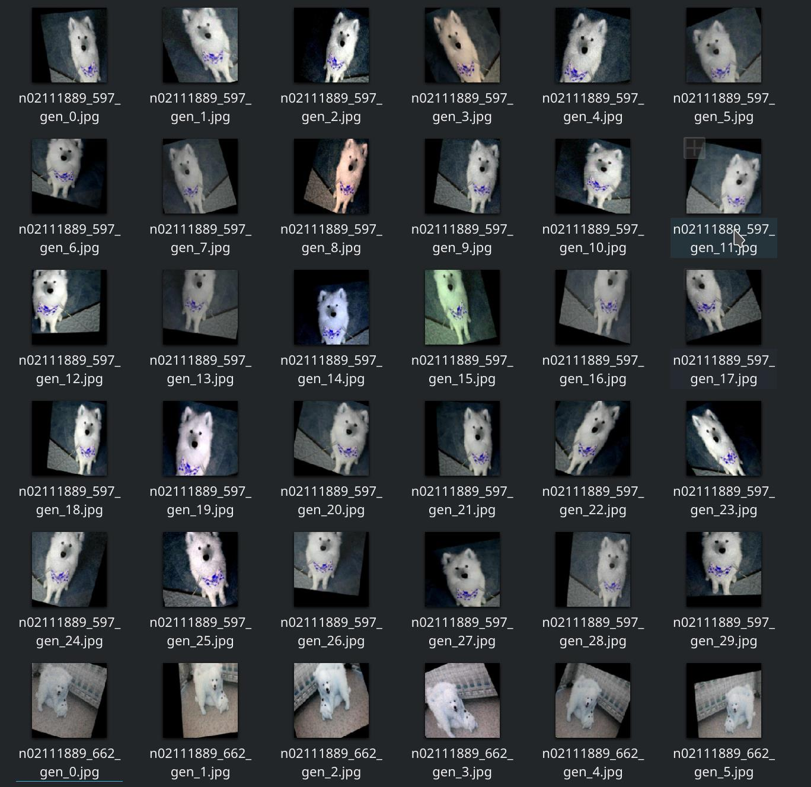
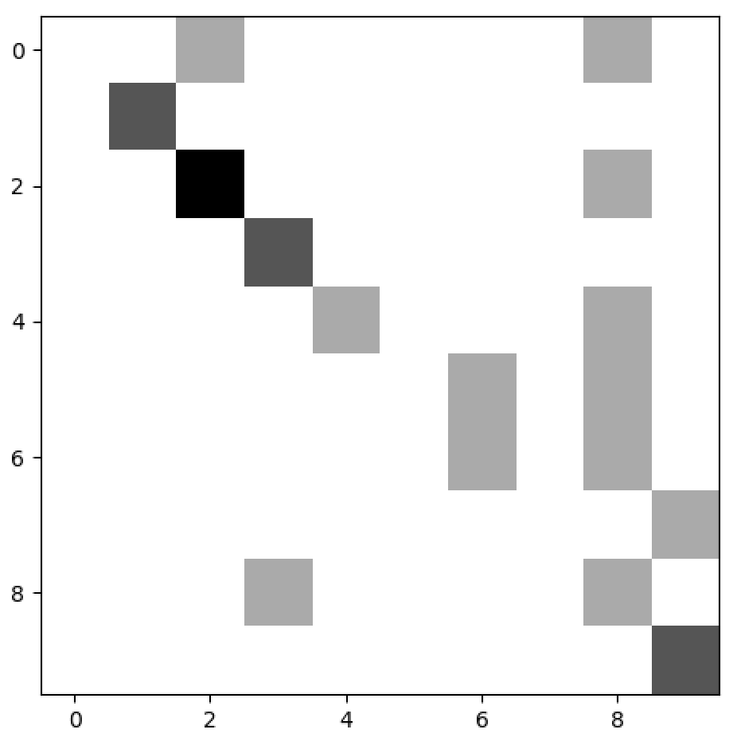
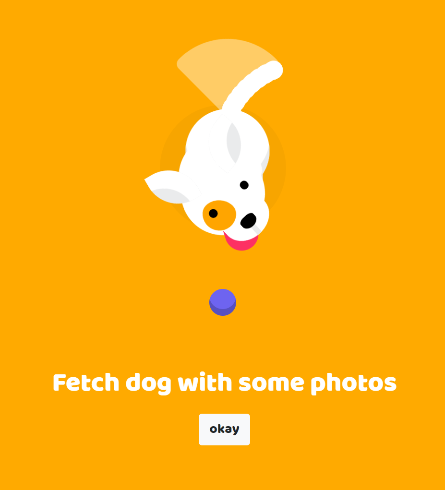

# Dogs net

## ADMISSION:

The project involves designing and modeling a neural network that will allow for
recognition of dog breeds. The idea was taken from Stanford University, in which
a group of scientists was developing a model for the classification of 120 dog breeds based on images from
ImageNet database. In the following description some of the conducted will be presented
experiments.

Link to the study: [http://vision.stanford.edu/aditya86/ImageNetDogs/](http://vision.stanford.edu/aditya86/ImageNetDogs/)

## TOOLS:

An environment was used to design and train the convective neural network
anaconda with engine for Tensorflow and aperas Keras neural networks To faster
Nvidia graphics card with CUDA architecture (Gtx 1060 6GB) was used for training, which
allows faster parallel calculations, thus saving time and opportunity
test more solutions. To manage all libraries for
Python interpreter was used conda manager instead of pip, which contains the most stable
versions of current libraries. Matrix images were used to process the images
openv, numpy and pillow libraries. Auxiliary functions for data processing have been taken
from the scikit-learn library A web server for downloading additional images has also been written
in Python using the Django framework.

A short list of used libraries (without any dependencies) and technologies:

- Python interpreter version 3.7 with basic libraries
- Numpy
- Tensorflow 2.
- Keras
- Scikit-learn
- Opencv (cv2)
- Pillow
- Django
- Html
- Javascript
- Css
- Jquery
- Imgaug

To download all libraries, download the anaconda environment and then download
modules for the environment used.

## GLOSSARY OF TERMS USED:

- cnn - convolutional neural network
- ann - artificial neural network - intelligent neural networks
- e.g. - numpy - matrix library for python
- loss - function / value that describes the deviation of the model value from the value
    real
- acc - accuracy - the ratio of correctly predicted classes to all data
- val_acc - acc for the validation set
- gradient descent - algorithm for optimization of the loss function
- tf - tensorflow - a library for creating neural networks
- keras - api to the tf engine for easy use
- ImageNet - the largest database containing pictures divided into classes
- backpropagation - an algorithm using a descent gradient in neural networks
- feedforward - calculation of the output value for the input data in the network
    neuronal
- epoch - conversion of values ​​for the whole set (single)
- crawler - an automated program that collects specific data from the network
- learning rate - a parameter determining the size of the change in the weight value for a single
    iteration gradient descent

## THEORY:

Issues in the field of machine learning and deep learning were raised. The project has
to create a model that classifies dog breeds based on input data.
The model was created based on convulsive neural networks, which are a subset
more widely known neural networks. Architecture of these networks
additionally uses convulsion layers together with filters that analyze images
input as small fragments of images, which gives a better result because it is recognized
the object does not have to be located in the same place in the picture, it is dynamic
recognized. The whole theory of the operation of convulsion networks is presented in the article:
[http://cs231n.github.io/](http://cs231n.github.io/) and [http://cs231n.github.io/convolutional-networks/.](http://cs231n.github.io/convolutional-networks/).

## MILEAGE:

The first approach to the problem was to create a neural network from scratch, which
allows the classification of 120 dog breeds. The main problem in this approach is intercourse
the number of data in the database to the number of classifiers. The ImageNet database has about 150-200 photos
dog breeds, which places very restrictive conditions on the classification. In many publications
neural networks have been created that allow the classification of several hundred different objects,
however, they are objects that are very different (e.g. plane, car, dog).

## PREPARATION OF DATA:

Photos in the form of jpg or png are not suitable as an entry to a neural network, the network is able
accept only numeric matrices, therefore, images should be converted to standardized
fixed-size matrices and giving them the appropriate classifier, also in form
matrix known as 'OneHotEncoder'. A library was used to load the images
opencv, then the given matrix has been converted to the 'numpy' matrix that remained
written in c ++ for greater computing performance. Matrices in order
were normalized using the standardization function from the 'Keras' package. Normalization
data allows you to minimize the time to calculate the "gradient descent" which is the heart
back propagation algorithm that minimizes loss and makes the network classify
input with greater accuracy.

Classes are assigned based on data from a hash table that projects the race name onto
numerical value. Example for 10 classes:

Dogs = {

'Maltese': 0,
'Pomeranian': 1,
'Samoyed': 2,
'Pug': 3,
'Chow': 4,
'African_hunting': 5,
'Dingo': 6,
'Borzoi': 7,
'Border_collie': 8,
'Golden_retriever': 9,
}

Arrays have been prepared for 10 classifiers without any problem, however, during
normalization of 120 classes for more than 20k photos computer resources have run out and the given matrix
it didn't even fit in 50gb RAM + SWAP.

Therefore, the classification of for more data has been changed from
cache the entire database and a generator has been written that returns
matrices adequate to 'batch size' for a given network. Only stored in memory
paths to images divided into a test and training set, and matrix preparation is provided
performed on an ongoing basis for each 'batch' in the network.

## CLASSIFICATION OF 120 DOG BREEDS:

The application of the generator allowed to train the network and achieve the following results:

loss: 3.6067 - acc: 0.2553 - val_loss: 13.6974 - val_acc: 0.1501

The network used was based on another network, the construction of which will be described later in this work.

Precision has been calculated here for the whole set, not for individual classes, due to the quantity
data for each class is different, it can be deduced that acc for each class is significantly
different. Further experiments for 120 classes did not give better results, therefore in the following
only the classifier for 10 dog breeds will be analyzed for which
achieving greater precision will be easier, and methods will be described
you can improve the existing network model.

## CLASSIFICATION OF 10 DOG BREEDS:

During the classification of 10 races, the use of a generator was no longer required, so the data was left
directly read into cache from a previously prepared matrix, e.g.

The above network accepts image matrices in the format (200,200.3) → (width, height,
number of colors (RGB)), 10x1 vector is output and the softmax function inserts
1 in the place of the class with the highest converted value. Softmax function operation:

Convection layers with 32 filters and 2x2 size windows were used in the network
1x1 offset, the 'rel' activation functions allowed for faster calculations compared to
other activation functions and also introduced non-linearity to the system. 'Pooling' layers
allowed to reduce the size of the output matrix from convective layers, co
minimizes the number of scales in the network and allows them to fit into the graphics card, which
the main limitation is VRAM. The 'dropout' layers introduce regularization to
a model that prevents 'overfit' for the network. Finally, the 'dense' layer is applied
which converts convulsion layers into a standard network layer that can stay
used for initial classification.

Increasing the number of 'epochs', changing architecture and optimizers, no grades were produced
better results.

The best result for the above architecture:

loss: 13.9754 - acc: 0.1329 - val_loss: 13.8049 - val_acc: 0.1435

## NETWORK ARCHITECTURE STRUCTURE:

Layer (type) Output Shape Param #
================================================== ===============
conv2d_1 (Conv2D) (None, 200, 200, 32) 416
_________________________________________________________________
activation_1 (Activation) (None, 200, 200, 32) 0
_________________________________________________________________
conv2d_2 (Conv2D) (None, 199, 199, 32) 4128
_________________________________________________________________
activation_2 (Activation) (None, 199, 199, 32) 0
_________________________________________________________________
max_pooling2d_1 (MaxPooling2 (None, 99, 99, 32) 0
_________________________________________________________________
dropout_1 (Dropout) (None, 99, 99, 32) 0
_________________________________________________________________
conv2d_3 (Conv2D) (None, 99, 99, 64) 8256
_________________________________________________________________
activation_3 (Activation) (None, 99, 99, 64) 0
_________________________________________________________________
conv2d_4 (Conv2D) (None, 98, 98, 64) 16448
_________________________________________________________________
activation_4 (Activation) (None, 98, 98, 64) 0
_________________________________________________________________
max_pooling2d_2 (MaxPooling2 (None, 49, 49, 64) 0
_________________________________________________________________
dropout_2 (Dropout) (None, 49, 49, 64) 0
_________________________________________________________________
flatten_1 (Flatten) (None, 153664) 0
_________________________________________________________________
dense_1 (Dense) (None, 1024) 157352960
_________________________________________________________________
activation_5 (Activation) (None, 1024) 0
_________________________________________________________________
dropout_3 (Dropout) (None, 1024) 0
_________________________________________________________________
dense_2 (Dense) (None, 512) 524800
_________________________________________________________________
activation_6 (Activation) (None, 512) 0
_________________________________________________________________
dropout_4 (Dropout) (None, 512) 0
_________________________________________________________________
dense_3 (Dense) (None, 10) 5130
_________________________________________________________________
activation_7 (Activation) (None, 10) 0
================================================== ===============
Total params: 157.912,
Trainable params: 157.912,
Non-trainable params: 0

## TRANSFER LEARNING:

The next step was to use a technique known as transfer learning. The biggest
the limitation on creating a better model in this case was the amount of data
training. Due to the fact that there is no model that can do very well
to classify a given dog breed, writing any 'crawlers' will not increase
the test set because it would have to be manually classified.

Transfer learning is a method that allows the use of previously trained networks
neural and modify them in a way that will allow you to use them in your own
range. The biggest problem in implementing this architecture was the 'overfit' model,
because the network used had a very extensive architecture, experiments included
change of optimizers and regularization.

The MoblieNet network was used together with weights trained for the ImageNet database,
network modification consisted in removing the last output layer (1000 classifiers) and
replacing her own, which in this case consisted in the classification of 10 dog breeds.

Example network result:

loss: 0.0042 - acc: 0.9990 - val_loss: 1.6310 - val_acc: 0.7523

As you can see, the use of the transfer learning method resulted in an increase
precision from 15% to over 70%. Despite working on the same database.

Conducting experiments consisting in changing the network's output architecture
gave similar results, but by far the best optimizer is 'adadelta'.

Based on the experiments, charts were generated that represent the precision
a validation set depending on 'epochs'.

Value jumps are due to the fact that the classification efficiency for each class was not
equal, and the draw of the validation set for each 'epoch' contained a different amount of data
class.

## GENERATION OF ARTIFICIAL SAMPLES:

Due to the fact that the biggest limitation in creating a better prediction model was
insufficient training data, the next approach was to produce
artificial photos based on existing ones. The Imgaug library was used for this.

An example of how a script based on a single photo works:

Example of generated photos:

Unfortunately, generating new photos did not increase the precision of the model, but deteriorated.

Result after re-training the network:

val_loss: 2.8868 val_acc: 0.37083

## VALIDATION OF EXAMPLES:

A script was also prepared that classifies dogs based on the images found
in the appropriate folder.

Examples of program operation:

maltese_2.jpg -> Border_collie

borzoi_1.jpg -> Golden_retriever

samoyed_4.jpg -> Samoyed

golden_2.jpg -> Golden_retriever

chow_1.jpg -> Chow

golden_1.jpg -> Golden_retriever

maltese_1.jpg -> Samoyed

dingo_2.jpg -> Border_collie

samoyed_2.jpg -> Samoyed

border_1.jpg -> Pug

pug_2.jpg -> Pug

samoyed_3.jpg -> Border_collie

pug_1.jpg -> Pug

african_2.jpg -> Border_collie

chow_2.jpg -> Border_collie

border_2.jpg -> Border_collie

dingo_1.jpg -> Dingo

pomeranian_1.jpg -> Pomeranian

pomeranian_2.jpg -> Pomeranian

african_1.jpg -> Dingo

samoyed_1.jpg -> Samoyed

## ERROR MATRIX:

Achieved parameters:

loss: 5.08390 acc: 0.57142

These are only sample data, and the precision of individual classifiers varies significantly,
so when choosing other evaluation photos, the precision can be up to 100%

## DOWNLOADING NEW DATA:

As mentioned above, the biggest limitation in achieving better
results are insufficient samples to classify photos. One way to go
obtaining additional photos was their artificial generation based on already
existing (imgaug), however, this experiment failed and only reduced the precision
network. Another way is to write a crawler / bot that would download new photos from
Internet, the limitation here is the validation of downloaded photos, there is no guarantee
whether the photos on the network under the slogan of a given breed will be real and their validation on
underlying low performance networks are unlikely.

Another way to get new samples is to write an application to download
from the user a photo as well as information about what class it is a sample. Then after
validating with an already trained network could save a photo to disk if
the prediction of a given class coincides with that given on the basis of a certain threshold
output probability.

## APPLICATION FOR NEW SAMPLING:

The start page of the photo download application has been written based on the one already discussed
rules.

## INTERPRETATION OF RESULTS:

The validation precision of the above models does not differ significantly because the main one
the limitation of this model is the abovementioned insufficient number of samples per data
class, while the introduction of regularization into the network resulted in most cases
increase in val_acc / acc. ratio The above results are absolute results for the calculations
epochs = 10, batch size = 64 (vram gpu limitation), therefore some of the models
found local minima of the loss function and weights were not significantly changed. Solution
this problem was the use of various 'gradient descent' optimizers, where for some
it was not required to specify the 'learning rate' parameter and to change epochs / batch settings
size '.

However, the use of the transfer-learning method has significantly increased
precision of each of the above models from about 15% to about 70%.

## CODE CONTENT:

- src - scripts directory
- EvalImages - catalog of photos subjected to classification
- images - photos of all dog breeds
- images_slice - photos of 10 selected dog breeds
- imagaug - artificially generated photos of dogs
- logs - tensorflow logs
- models - saved network models
- np_data - saved data arrays in the form of numpy
- page - application for downloading new photos
- Plots - generated network architectures
- src / count_dogs.py - script counting the number of photos for a given breed
- src / data_preparation.py - script to save photos in the form of a matrix, e.g.
- src / Dog_dict.py - an array that has the name of the breed with a numeric value
- src / DogImageGeneratorImgaug.py - data generator for training with artificially
    generated photos
- src / DogImageGeneratorMin.py - training data generator for 10 classes
- src / Evaluate.py - a script to classify photos contained in the EvalImages i folder
    displaying the basic metric
- src / img_gen.py - a script that creates artificial samples and saves them in a folder
    imgaug
- src / imgaug_network.py - script that trains the loaded network based on the photos in the folder
    imgaug
- src / network.py - script to create cnn from scratch and train based on data
    np_data
- src / transfer_network_gen.py script creating a new network based on pretrained and
    training based on all (120) classes
- src / transfer_network_min.py script creating a new network based on pretrained and
    training based on 10 classes (result saved as 'best_model.h5')

Due to the large size of the models and the training / test data, they were not
included in the attachment.

## SOURCES:

- https://towardsdatascience.com/keras-transfer-learning-for-beginners-6c9b8b7143e
- [http://cs231n.github.io/convolutional-networks/](http://cs231n.github.io/convolutional-networks/)
- https://ruder.io/optimizing-gradient-descent/?fbclid=IwAR2L8PvO9y6i8Or1tiAPNSU-1K2t3RRPqHAEkAz5heeKy5KHUheG7sY3Qjw
- [http://cs231n.github.io/convolutional-networks/](http://cs231n.github.io/convolutional-networks/)
- [http://vision.stanford.edu/aditya86/ImageNetDogs/](http://vision.stanford.edu/aditya86/ImageNetDogs/)
